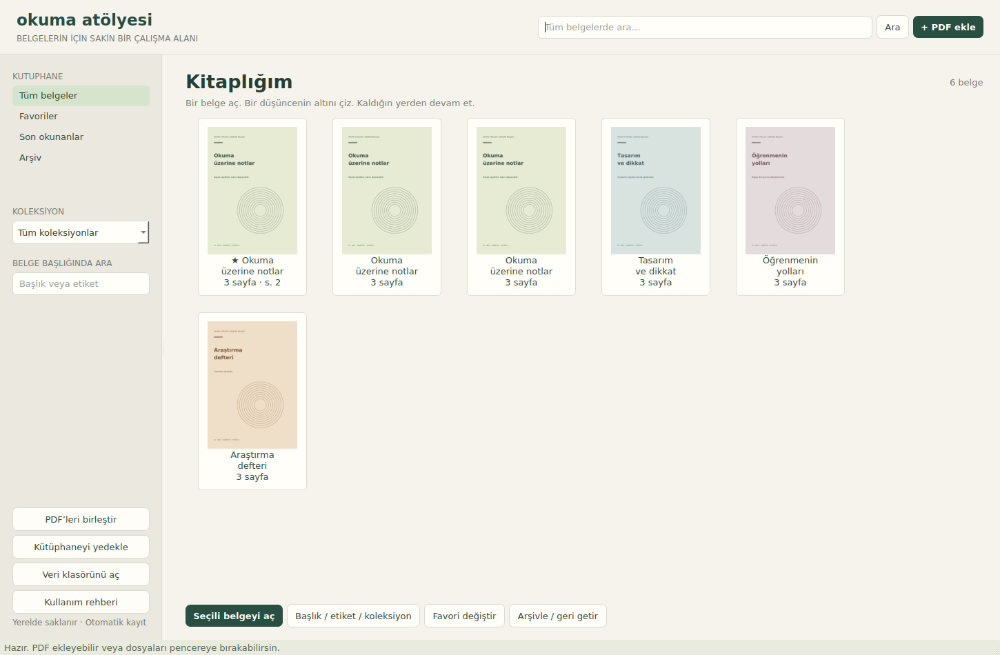
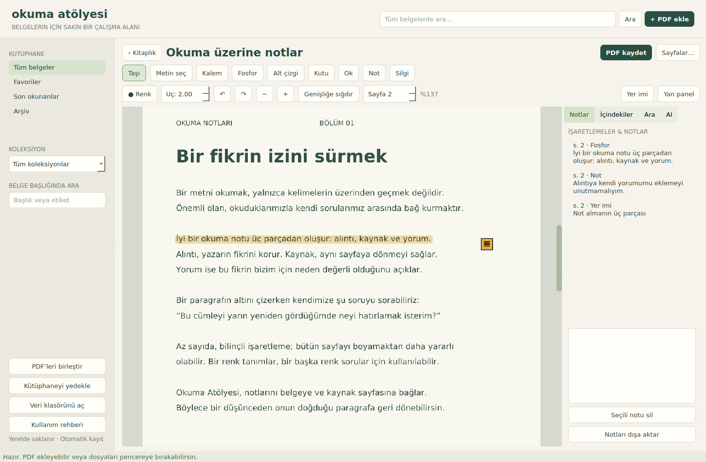

# Okuma Atölyesi 1.0

**Belgelerin için sakin bir çalışma alanı:** kendi bilgisayarında çalışan bir PDF kütüphanesi ve okuyucusu, üstüne Word benzeri bir belge editörü. İnternet ya da hesap gerekmez; her şey senin klasöründe kalır.

- **Oku ve işaretle:** fosfor, kalem, alt çizgi, kutu, ok, not ve yer imleri. Notlar sayfasına bağlı kalır, dışa aktarılabilir.
- **Kütüphane:** favoriler, koleksiyonlar, etiketler, tüm belgelerde tam metin arama, kaldığın yerden devam.
- **PDF araçları:** birleştir, sayfa düzenle, OCR (taranmış sayfalar), yedekle/geri yükle.
- **Belge editörü:** sıfırdan `.docx` yaz. Biçimlendirme, listeler, tablolar, resimler, sayfa düzeni, üst/alt bilgi, PDF'e aktarma ve yazdırma var; tam Word gücü gerektiğinde tek tıkla LibreOffice'te açılır.
- **Varsayılan uygulama:** `.pdf` ve `.docx` dosyaları çift tıklayınca Okuma Atölyesi'nde açılabilir.
- **Yapay zekâ bağlantısı (isteğe bağlı):** MCP sunucusu sayesinde Limina, Claude Desktop gibi asistanlar kütüphanendeki belgeleri okuyabilir.

<p>
  
  
</p>

Limina'dan bağımsızdır: onun kodunu içe aktarmaz, ona dokunmaz.

> **In English.** Okuma Atölyesi ("Reading Workshop") is a local PDF library and reader with a
> Word-like document editor. Highlight, draw, annotate and bookmark PDFs; organize them with
> favorites, collections and tags; search the full text of every document; merge PDFs, OCR scanned
> pages, and back up your library. The editor writes `.docx` files from scratch (formatting, lists,
> tables, images, page layout, headers/footers, PDF export, printing) and opens a document in
> LibreOffice when you need full Word features. It can register as an "Open with" app for `.pdf`
> and `.docx`, and an optional MCP server lets AI assistants read your library. No account or
> internet connection is needed after setup. The interface is in Turkish.
>
> **Run it (Windows):** install Python 3.11+, double-click `kur.bat` once, then `baslat.bat`.
> Elsewhere: `python -m venv .venv`, `pip install -r requirements.txt`, `python app.py`.
> License: AGPL-3.0.

## Windows'ta başlat

1. ZIP dosyasını aç. `OkumaAtolyesi` klasörünü örneğin `C:\Araclar\OkumaAtolyesi` konumuna koy. Mevcut AI projesinin içine yerleştirmen gerekmez.
2. Python 3.11 veya daha yeni, 64 bit bir Python kurulu olsun. Python Launcher (`py`) kurulumda seçili olmalı.
3. `kur.bat` dosyasına çift tıkla. İlk kurulum internet bağlantısı ister. Bağımlılıklar yalnızca bu klasörün `.venv` ortamına kurulur.
4. Kurulum bitince `baslat.bat` dosyasına çift tıkla.
   Masaüstüne ikonlu, konsolsuz bir kısayol için bir kez `.venv\Scripts\python.exe kisayol.py` çalıştır ("Okuma Atölyesi.lnk").
5. `PDF ekle` ile bir PDF seç veya pencereye PDF bırak. Paketteki `Ornek_Belge.pdf` ile başlayabilirsin.

Bu paket kaynak kod içerir; hazır bir `.exe` değildir. Okuyucu için API anahtarı gerekmez. Kurulumdan sonra temel özellikler internetsiz çalışır. Mevcut AI ortamına bu paketin requirements dosyasını kurma.

Python Launcher yoksa, Python 3.11+ ile terminalde:

```powershell
python -m venv .venv
.venv\Scripts\python.exe -m pip install -r requirements.txt
.venv\Scripts\python.exe app.py
```

Linux/macOS:

```sh
python3 -m venv .venv
.venv/bin/python -m pip install -r requirements.txt
.venv/bin/python app.py
```

Linux'ta Qt masaüstü çalışma zamanı gereklidir. Ekransız sunucuda normal pencere açılamaz; testler `QT_QPA_PLATFORM=offscreen` kullanır.

## Bu sürümde çalışan özellikler

- PDF ekleme; **sürükle-bırak:** masaüstünden bırakılan PDF içe alınıp hemen açılır, bir raf satırının ya da soldaki raf başlığının üstüne bırakılırsa o rafa konur. Kartlar ve soldaki ağaçtaki belgeler de raflar arasında sürüklenir; üstünde durulan raf vurgulanır. Boş raflar da satır olarak görünür (bırakma hedefi). Rafların en altındaki **Yeni raf ekle** adasına tıklamak raf açar; üstüne kart ya da PDF bırakılırsa ad sorulup yeni rafa konur. Yinelenen dosya içerik özetiyle tanınır.
- **Birden çok kütüphane:** sol panelin en üstünde açık kütüphanenin adı ve klasörü. Düğmeden (ya da `Ctrl+L`) başka kütüphaneye geçilir; **Yeni kütüphane…** ad ve klasör ister (her kütüphane ayrı klasör: kendi PDF kopyaları, notları, veritabanı), **Var olan klasörü ekle…** daha önce oluşturulmuş bir kütüphaneyi listeye alır; yeniden adlandırma ve listeden kaldırma (klasör silinmez) da burada. Değişim yerinde olur: açık belge kaydedilir, oturum kapanır, yeni kütüphane açılır. Liste `%APPDATA%\OkumaAtolyesi\kutuphaneler.json`; açık olan `veri_yolu.txt` işaretçisine yazılır, MCP sunucusu da onu açar. Kütüphane yalnızca sol panelden değiştirilir.
- **Kitaplık, Steam kütüphanesi gibi:** solda her raf başlık olarak, altında belgeleri (en yeniden en eskiye); sağda raf satırları, kartlar 2:3 kapak. Rafa/belgeye sağ tık menüsü. Üst şerit tek satır (logo, ad, arama, PDF ekle, Görünüm); alt çubuk yok — belge eylemleri (aç, başlık/etiket, rafa koy, kapak, favori, arşiv) başlık satırındaki **Seçili belge ▾** menüsünde ve sağ tık menüsünde.
- **Kapak:** karta sağ tık → **Kapak tasarla…** — uygulama içinde: renk paleti ya da özel renk, düz/degrade zemin, istersen ilk sayfanın görüntüsü zeminde, başlık ve alt başlık, açık/koyu yazı, hizalama, yazı boyu, vurgu çizgisi; canlı önizleme. Tasarım `covers/<id>.cover.json`'da saklanır, yeniden düzenlenebilir. İstersen **Görselden seç…** ile kendi görselini de koyabilirsin; **Varsayılan kapağa dön** PDF'nin ilk sayfasına döner.
- **Raf rengi:** rafa sağ tık → Renk: hazır palet ya da özel renk. Renk kartlarda, satır kenarında ve sol ağaçta görünür.
- **Raflar:** her ders bir raf (ad, renk); belge tek rafa konur; raf silinince belgeler silinmez. Eski koleksiyonlar ilk açılışta rafa dönüştürülür (öncesinde `library.sqlite3.yedek-…` alınır). MCP'deki `collection` alanı raf adıdır.
- **Devam et:** kitaplığın üstünde en son çalışılan belge, kaldığı sayfa ve tek tıkla dönüş. Her belgede görülen sayfa / toplam, son çalışma zamanı ve toplam çalışma süresi.
- **Çalışma oturumu:** belge açıkken geçen *etkin* süre ölçülür — pencere öndeyken ve son hareketten (kaydırma, sayfa, işaretleme, fare, klavye) 5 dakika geçmemişken. Arkada açık kalan pencere sayılmaz. Okuyucudan çıkınca "Bu oturum: 12 dk · 4 sayfa · 2 işaretleme"; kitaplıkta "Bugün 40 dk · 12 sayfa · 6 işaretleme"; her rafta bu haftaki süre. Üst şeritte oturum süresi görünür.
- Başlık, etiket, favoriler, son okunanlar ve geri getirilebilir arşiv.
- Sürekli dikey kaydırma, yakınlaştırma, genişliğe sığdırma, sayfa numarası ve PDF içindekiler tablosu.
- Her belge için sayfa, sayfa içi konum ve yakınlaştırmanın otomatik hatırlanması.
- Serbest kalem, fosfor, alt çizgi, kutu, ok, sayfa notu ve yer imi.
- İşaretlemeleri listeleme, tam notu okuma, silme, kalıcı geri al/yinele geçmişi.
- Metin alanı seçme ve panoya kopyalama.
- Belge içinde ve kütüphane genelinde tam metin araması.
- İşaretlemelerin standart PDF açıklamalarına dönüştürülerek dışa aktarılması.
- Seçili sayfaları çıkarma, bölme, sıralama, döndürme ve PDF birleştirme. Bunlar yeni çıktı üretir.
- Not ve alıntıları kaynak sayfalarıyla Markdown'a aktarma.
- Yerel OCR ile taranmış sayfalara aranabilir ve seçilebilir metin dizini oluşturma.
- Kütüphaneyi PDF'ler, kapaklar, notlar, konumlar ve veritabanıyla ZIP yedekleme.
- AI'a kaynaklı açıklama, çeviri ve çalışma kartı isteği kopyalama.
- 21 MCP aracıyla dış AI'ın kütüphaneyi kullanması; açık pencereye belge/sayfa yönlendirmesi.

## Belge editörü (Word benzeri)

**Araçlar ▾ → Yeni belge (Word)** ya da **Belge aç (.docx)…** (veya `python -m belge [dosya.docx]`).
Sıfırdan `.docx` yaz: yazı tipi/boyut/renk/vurgu, kalın-italik-altı/üstü çizili, üst/alt simge,
başlık stilleri, hizalama, satır aralığı, madde/numara listeleri ve girinti, tablo (satır/sütun
ekle-sil), resim, sayfa sonu, kenar boşlukları, kâğıt boyutu ve yönü, üst/alt bilgi ve sayfa
numarası, bul-değiştir, kelime/sayfa sayısı, **PDF olarak dışa aktar**, yazdır.

İzlenen değişiklik, yorum, dipnot, içindekiler gibi tam Word özellikleri için **Dosya → LibreOffice'te
aç** (LibreOffice kurulu olmalı). Word'de yazılmış bir dosyada editörün taşıyamadığı içerik varsa
editör bunu söyler ve **özgün dosyanın üstüne kaydetmez** (o içerik silinirdi): Farklı kaydet ya da
LibreOffice.

## Varsayılan uygulama

**Araçlar ▾ → Varsayılan uygulama…** Okuma Atölyesi'ni .pdf ve .docx için "Birlikte aç" listesine
ekler (yalnızca bu kullanıcı, yönetici izni gerekmez) ve Windows Varsayılan Uygulamalar sayfasını
açar; orada Okuma Atölyesi'ni seç (Windows programların kendini sessizce varsayılan yapmasına izin
vermez). Çift tıklanan PDF kitaplığa eklenir (aynı dosya zaten varsa o belge açılır); okuyucu
açıksa o pencerede açılır. **Kaydı kaldır** aynı pencerede.

## Limina ile doğrudan çalışma

Üst şeritteki **Asistan** düğmesi, PDF'nin yanında Açıkla / Özetle / Çevir / Soru hazırla panelini açar. Metin seçince aynı işlemler alttaki küçük seçim şeridinde görünür. Limina açık olmalıdır; bağlantı durumu panelde belirtilir. Yanıt kaynak belge/sayfa bilgisiyle geri gelir. Seçim yoksa sayfanın ilk 3000 karakterlik bölümü kullanılır; devamı varsa belirtilir.

**Seçimi Smart Notes'a kaydet** ve **Yanıtı Smart Notes'a kaydet** kaynak bağlantısını korur; istenirse listeden proje seçilir. Bu eklentiler Limina'da etkin olmalıdır. Kaynak bağlantısı sohbetten veya nottan doğru PDF sayfasına döner. Çalışan isteği Limina'dan durdurun; paneldeki iptal yalnızca bekleyen isteği iptal eder.

Üst şeritteki **iğne** düğmesi otomatik gizlenmeyi kapatır; tercih hatırlanır. Not editörünün kaydedilmemiş taslağı belge değişiminde ve normal kapanışta yerel ayarlarda korunur.

İstek/yanıt kuyruğu `%APPDATA%/OkumaAtolyesi/assistant.sqlite3` dosyasıdır; okuyucu Limina'nın kodunu içe aktarmaz. Bağlantı, kullanıcı tıkladığında mevcut Limina modelini kullanır. Temel PDF okuma bağımsız ve çevrimdışı kalır.

## Okuyucuyu kullan

Belgeyi çift tıklayarak aç. Okuyucuda ekranda yalnızca sayfa vardır: başlık, kenar çubuğu ve durum çubuğu gizlenir.

- **Üst şerit:** fareyi pencerenin üst kenarına götürünce belirir (kitaplığa dön, belge adı, sayfa, yakınlaştırma, yer imi, panel, `⋯` menüsünde PDF kaydet / Sayfalar / OCR / AI isteği / tam ekran). Fare çekilince kaybolur. Şerit kapalıyken sol üst köşede silik bir **✕** durur: üstüne gelince belirginleşir, tıklayınca kitaplığa döner (şeridi açmadan). Widget değil, görünümün içine çizilir; kaydırma hızını etkilemez.
- **Kalemlik:** sağ kenarda dikey ada — Taşı, Metin seç, Kalem, Fosfor, Alt çizgi, Not, Silgi, `⋯` altında Kutu ve Ok; renk, uç kalınlığı, geri al/yinele. Şeritteki **Kalemlik** düğmesi, sağ kenardaki tutamak ya da `T` ile açılıp kapanır; kapalıyken yalnızca 12 px'lik tutamak kalır. Durumu hatırlanır.
- **Notlar paneli:** şeritteki **Notlar** düğmesi ya da `N`. Üstteki kutuya yazıp "Not olarak kaydet" dersen açık sayfaya not eklenir; listeden bir not seçip metnini değiştirebilirsin (geri alınabilir). Liste notları, metinli fosfor/alt çizgileri ve yer imlerini gösterir; kalem çizgileri "Çizimleri de göster" ile. Diğer sekmeler: İçindekiler, Ara.
- **Okuma modu** (şeritteki **Okuma** düğmesi ya da `R`): sayfa genişliği okunur bir ölçüye sabitlenir, zemin kâğıt rengine döner ve sayfa sınırları kaybolur (akan metin), kalemlik ve panel kapanır. Ayar hatırlanır.
- **Düzen** (`⋯` → Düzen): program belgenin türünü tahmin eder — yatay sayfa **slayt** (sayfa ekrana tam sığar; tekerlek, ok tuşları, Space/PageDown sayfa sayfa), dikey sayfa **kitap** (sürekli kaydırma; PageDown/Space bir ekran, oklar satır). Tahmin yanlışsa elle **Slayt** / **Kitap** seç; belge başına hatırlanır.
- **Görünüm** (kitaplık başlığındaki düğme ya da şerit `⋯` menüsü): uygulama teması **Açık / Koyu**; okuma zemini **Kağıt / Sıcak / Loş / Gece**. Sayfa zemini yarı saydamdır (PDF'nin beyazı da), altındaki ton görünür; Gece'de sayfa içeriği ters çevrilir (resimler de). Seçimler hatırlanır.
- `Esc` önce paneli, sonra kalemliği kapatır, sonra kitaplığa döner. Tekerlek kaydırması yumuşak ve sönümlüdür; `Taşı` aracıyla sayfayı tutup sürükleyebilirsin.

| Araç | Kullanım |
|---|---|
| Metin seç | Bir sözcükten diğerine sürükle; seçim okuma sırasıyla akar (sütun değil). Seçilen metin panoya gelir. **Okuma imi** açıkken (kalemlikteki şerit düğmesi) imleci izleyen yarı saydam bir şerit okuduğun satırı gösterir; kalınlığı uç menüsünden. Yazmaz, kaydedilmez. |
| Kalem | Basılı tutup çiz; çizgi yumuşatılır. Renk ve uç kalınlığı her araç için ayrı tutulur ve hatırlanır. |
| Fosfor / Alt çizgi | Gerçek kalem gibi metnin üstünden geçir; izin değdiği sözcükler satır satır işaretlenir, önizleme sürüklerken görünür. Fosfor metin olmayan yerde kalın yarı saydam serbest iz bırakır. |
| Kutu / Ok | Başlangıçtan bitişe sürükle. |
| Not | Sayfaya tıkla, notunu yaz; ya da paneldeki kutuya yazıp kaydet. Sayfadaki not ikonuna tıklamak notu panelde açar. |
| Silgi | Üzerine gelince silinecek işaretleme kırmızıya boyanır; tıkla ya da basılı tutup sürükle. Bir işaretlemenin tümünü kaldırır. |
| Yer imi | Açık sayfaya adlandırılmış yer imi ekler; sayfanın sağ üstünde kurdele olarak görünür. |
| PDF kaydet | Notları ve çizimleri içeren yeni PDF üretir; dosya konumunu seçtirir. |
| Sayfalar | `1-3,7,5` gibi bir sıralama gir; gerekirse dönüş açısı seç. |

Fosfor aracında metin bulunamazsa iz serbest fosfor izi olarak kaydedilir ve PDF'ye yarı saydam çizim olarak aktarılır. Taranmış PDF'de gerçek metin seçimi için önce OCR yap.

Klavye kısayolları (`F1` ya da Araçlar ▾ → Klavye kısayolları ile uygulama içinde de listelenir). Harf/rakam kısayolları bir metin kutusunda yazarken çalışmaz.

| Kısayol | İşlev |
|---|---|
| Ctrl+O | PDF ekle |
| Ctrl+L | Kütüphane menüsü (değiştir / yeni) |
| Ctrl+Shift+N | Yeni raf |
| Ctrl+K | Kitaplıkta başlık ara |
| Ctrl+Shift+F | Tüm belgelerde ara |
| Enter | Seçili belgeyi aç (kitaplık) |
| Delete | Arşivle / geri getir (kitaplık) |
| Ctrl+E | Başlık / etiket |
| Ctrl+D | Favori değiştir |
| Ctrl+Z | İşaretlemeyi geri al |
| Ctrl+Shift+Z | Yinele |
| Ctrl+tekerlek, Ctrl + / Ctrl − | Yakınlaştır / uzaklaştır |
| Ctrl+0 | Genişliğe sığdır |
| Ctrl+G | Sayfaya git |
| Ctrl+B | Yer imi ekle |
| Ctrl+F | Belgede ara (okuyucu) / kitaplıkta ara |
| Ctrl+S | İşaretlemeli PDF dışa aktar |
| T | Kalemliği aç / kapat |
| N | Paneli aç / kapat |
| R | Okuma modu |
| 1 … 7 | Araç: Taşı, Metin seç, Kalem, Fosfor, Alt çizgi, Not, Silgi |
| ← → / Space / PageDown | Slaytta önceki-sonraki sayfa; kitapta bir ekran |
| Home / End | İlk / son sayfa |
| F1 | Klavye kısayolları |
| F11 | Tam ekran |
| Esc | Paneli / adayı kapat; sonra kitaplığa dön |

Sayfa görüntüleri ayrı bir üretim sürecinde (`render_worker.py`) hazırlanır; uygulama bunu kendisi başlatır ve kapatır. Kaydırma, yakınlaştırma ve işaretleme sırasında arayüz üretimi beklemez; henüz hazır olmayan sayfa beyaz görünür ve hazır olunca yerine geçer. İşaretlemeler sayfa görüntüsüne işlenmez, üstünde ayrı bir katmanda çizilir; kalem, fosfor ve silgi anında yansır. `PDF kaydet` ile PDF açıklamasına dönüştürülür.

Notlar her tamamlanan işlemde veritabanına yazılır. Okuma konumu hareket bittikten yaklaşık 450 ms sonra ve normal kapanışta kaydedilir. Ani güç kaybında henüz tamamlanmamış çizgi veya bu kısa aralıktaki son kaydırma kaybolabilir.

## Dosyaların konumu

Varsayılan veri klasörü Windows'ta `%USERPROFILE%\OkumaAtolyesiVeri`, diğer sistemlerde `~/OkumaAtolyesiVeri` olur. **Kütüphane ▾ → Veri klasörünü taşı…** ile başka bir diske (ör. `D:\OkumaVeri`) taşıyabilirsin: klasör kopyalanır, doğrulanır ve yol `%APPDATA%\OkumaAtolyesi\veri_yolu.txt` içine yazılır; uygulama ve MCP sunucusu bundan sonra oradan açılır (eski klasör silinmez). `Veri klasörünü aç` düğmesi geçerli klasörü açar.

| Konum | İçerik |
|---|---|
| `originals/` | İçeri alınan PDF'lerin yönetilen çalışma kopyaları |
| `covers/` | Kapak önizlemeleri; `<id>.custom.png` kişisel kapak |
| `library.sqlite3` | Kitaplık, raflar, çalışma oturumları, sayfa metinleri, notlar, konumlar (görülen sayfalar dahil) ve işlem geçmişi |
| `library.sqlite3.yedek-…` | Şema değişikliğinden hemen önce alınan tutarlı kopya; istersen silebilirsin |
| `imports/` | MCP için varsayılan izinli içe aktarma klasörü |
| `exports/` | PDF, Markdown ve yedek çıktıları |

Kaynak PDF içe aktarmada taşınmaz veya değiştirilmez. Okuyucunun notları önce veritabanında tutulur; `PDF kaydet` ile PDF'ye işlenir. Dosyayı dışa aktarırken vazgeçsen de üretilen kopya `exports/` içinde kalır; burası geçici dosya klasörü değildir.

Farklı bir veri klasörü için hem uygulamaya hem MCP sunucusuna aynı argümanı ver:

```powershell
.venv\Scripts\python.exe app.py --data-dir "D:\OkumaVeri"
.venv\Scripts\python.exe server.py --data-dir "D:\OkumaVeri"
```

Öncelik sırası: `--data-dir` > `OKUMA_DATA_DIR` ortam değişkeni > `veri_yolu.txt` işaretçisi > varsayılan. Sol panelden kütüphane değiştirmek işaretçiyi seçilen klasöre yazar; kayıtlı kütüphanelerin ad/yol listesi `kutuphaneler.json` dosyasındadır (işaretçiyle aynı klasörde). Veri klasörünü kaynak kod klasörünün dışında tut. Arşivleme dosyayı silmez; bu sürüm kalıcı silme aracı sunmaz.

Parola korumalı PDF GUI'den doğru parola ile içe alınabilir. Parola saklanmaz; çalışma kopyası şifresiz saklanır. Orijinal parola korumalı dosya değişmez. İçeri almadan önce uygulama bunu parola penceresinde belirtir.

## OCR

OCR isteğe bağlıdır. Tesseract ve istediğin dil verileri ayrıca kurulu olmalı. Türkçe için `tur`, İngilizce için `eng`, ikisi için `tur+eng` kullanılır. Sisteminde gerekiyorsa `TESSDATA_PREFIX` değişkenini `.traineddata` dosyalarının bulunduğu klasöre ayarla ve uygulamayı yeniden aç.

Okuyucuda `Ara > OCR: sayfa aralığı` seç. Bir işte en fazla 20 sayfa işlenir. OCR arama ve metin seçimine eklenir; dışa aktarılan PDF'ye görünmez OCR metin katmanı eklenmez. Asıl sayfa görüntüsü korunur. El yazısı tanıma garantisi yoktur.

Tesseract kurulum kaynakları: [resmî kurulum belgeleri](https://tesseract-ocr.github.io/tessdoc/Installation.html), [dil dosyaları](https://github.com/tesseract-ocr/tessdata).

## AI bağlantısı

`CLAUDE_ENTEGRASYON.md` dosyasını Claude'a ver. Ana projede bağlantıyı Claude ekleyebilir. Bu paket mevcut projede değişiklik yapmaz, API anahtarı istemez ve kendi başına model çağırmaz.

Bağlantıdan sonra örnek istekler:

- “Kütüphanemde araştırma geçen belgeleri bul.”
- “Okuyucuda seçtiğim bölümü kaynak sayfasıyla açıkla.”
- “Bu belgenin işaretlediğim yerlerinden bir çalışma özeti çıkar.”
- “Şu açıklamayı 12. sayfaya not olarak ekle ve sayfayı aç.”
- “Birinci ve üçüncü sayfaları ayrı PDF olarak kaydet.”

Açıklama, çeviri, özet ve çalışma kartlarını bağlı AI üretir. Bu uygulama belge erişimini ve notların kaydını sağlar. Belge içerikleri MCP ile AI'a verildiğinde AI'ın kullandığı model/API sağlayıcısına gidebilir.

## Yedekleme ve geri yükleme

`Kütüphaneyi yedekle` ile tutarlı bir SQLite anlık görüntüsü ve ilgili PDF/kapak dosyaları bir ZIP'e alınır. Dışa aktarılmış PDF'ler ve önceki yedekler bu ZIP'e eklenmez.

Geri yüklemek için okuyucuyu ve MCP sunucusunu kapat. Güvendiğin, bu uygulamanın oluşturduğu yedeği **yeni ve boş bir klasöre** aç. Sonra okuyucuyu ve sunucuyu o klasöre `--data-dir` ile yönlendir. Mevcut veri klasörünün üstüne dosya karıştırma; `library.sqlite3-wal` gibi eski çalışma dosyalarıyla çakışabilir. Bu sürümde GUI'den tek tuşla geri yükleme yoktur.

## İlk sürümün sınırları

- Dokunmatik kalem basıncı, eğim ve avuç içi reddi için özel destek uygulanmadı. Fare çizimi doğrulandı; fiziksel kalem davranışı Windows cihazında denenmeli.
- Silgi piksel silmez; bir çizgi/not/işaretlemeyi bütünüyle kaldırır. Başka programlarda eklenen açıklamalar korunur ve dışa aktarılır; bu sürümün silgi/geçmişine dahil değildir.
- Metin seçimi PDF'nin sözcük sırasını izler. Karmaşık çok sütunlu belgelerde okuma sırasını kontrol et; sütun seçimi yoktur.
- Arama sözcük tabanlıdır; anlam/embedding araması veya Türkçe kök bulma değildir. OCR kalitesi belgeye göre değişir.
- PDF paragraflarını Word gibi yeniden yazma, form doldurma, EPUB ve cihazlar arası eşitleme bu sürüme dahil değildir.
- İçindekiler için PDF'nin mevcut başlık ağacı kullanılır. Ayrı sayfa küçük resimleri paneli yoktur; kapak önizlemeleri kütüphanededir.
- Dosya başına 512 MB sınırı ve liste başına en fazla 1000 belge vardır. Çok büyük koleksiyonlar için performans ölçümü yapılmadı. Dışa aktarma, birleştirme ve OCR gibi uzun dosya işlemlerinde okuyucu eylemleri geçici olarak devre dışıdır.
- Yedekleme, arşivleme ve metadata düzenleme için işaretleme geri al/yinele düğmesi kullanılmaz. Geri alma geçmişi çizimler ve notlar içindir.
- Yerel API veya tarayıcı sunucusu açılmaz. MCP stdio kullanır. Tarayıcı/gönderim/ağ otomasyonu bu paketin kapsamı değildir.

## Testler

```powershell
.venv\Scripts\python.exe -m pip install pytest
.venv\Scripts\python.exe -m pytest tests -q
```

Doğrulama kapsamı ve gerçek test sonucu `TEST_RAPORU.md` dosyasındadır. Windows üzerinde kullanıcı cihazı testi henüz yapılmadı.

## Dosya yapısı

- `app.py`: PySide6 masaüstü arayüzü, çizim ve okuma davranışı.
- `core.py`: PDF, SQLite, arama, not, kayıt ve dışa aktarım çekirdeği.
- `server.py`: MCP stdio sunucusu.
- `kur.bat`, `baslat.bat`, `baslat.sh`: izole kurulum ve başlatma.
- `tests/`: çekirdek, masaüstü ve gerçek MCP testleri.
- `Ornek_Belge.pdf`: denemek için hazırlanmış üç sayfalık örnek.

Teknik başvuru: [PyMuPDF](https://pymupdf.readthedocs.io/en/latest/), [Qt for Python](https://doc.qt.io/qtforpython-6/), [MCP Python SDK](https://github.com/modelcontextprotocol/python-sdk), [SQLite FTS5](https://sqlite.org/fts5.html).

## Lisans

Okuma Atölyesi [GNU AGPL-3.0](LICENSE) lisansıyla dağıtılır: kullanabilir, değiştirebilir ve paylaşabilirsin. Değiştirilmiş bir sürümü dağıtırsan ya da ağ üzerinden kullandırırsan, onun kaynak kodunu da aynı lisansla açman gerekir. Lisans, kullanılan PDF kütüphanesi PyMuPDF (AGPL-3.0) ile uyumlu olsun diye seçildi.
